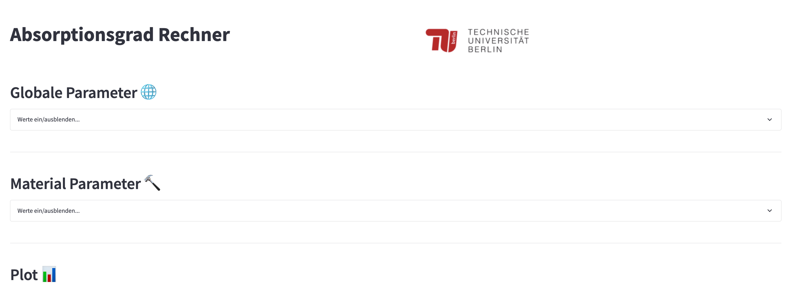

# Welcome to the Absorption Coefficient Calculator!

This software is a tool for calculating the absorption coefficient of different types of absorbers. 
The goal of this tool is to enable anyone to quickly calculate the absorption coefficient for different frequencies, 
either for one material or multilayered materials. It was developed within the "Python & Akustik" course at the
TU Berlin, imparted by Prof. Dr. Ennes Sarradj in the summer semester of 2023.

Try it [here](https://absorption-coefficient-calculator-app.streamlit.app/)!

The app is divided in three parts. The first part is the **Global Parameters**. Here you can choose the frequency range,
angle of incidence, plot type and the air conditions.

The second part is the **Material Parameters**. Here you
can define the material depending on the model you want to calculate the absorption coefficient for. 
You can add a maximum of 5 materials. The models are further explained in the [models](models.md) section.

The third part shows the **Results**. Here you can see the output of the calculations in a graph and as a table. 
Additionally, you can download the results as a .csv file.